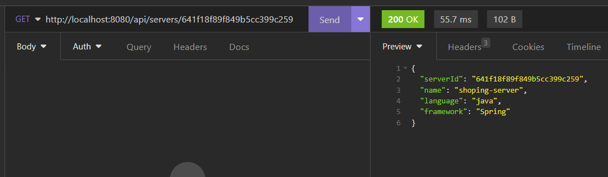

# Task-1-Kaiburr-Assessment
#### The purpose of this repository is to provide a solution to Task 1 from the Kaiburr's Assessment. Submitted by Dev Bilaspure.

### Task Description
The task is to implement a Java application that provides a REST API with endpoints for searching, creating, deleting and updating "server" objects.  
All "Server" objects should be stored in a MongoDB database. The implementation should include appropriate error handling and should be testable using tools such as Postman, curl, or any other HTTP client.

### Project Description
This is a Java application built with Spring Boot that provides a REST API for managing "server" objects. The application uses MongoDB as the backend database to store the server objects.  
The API is fully tested and comes with appropriate error handling to ensure reliability and accuracy.  
This repository provides a complete solution to the task and includes detailed documentation and code examples to help you get started. Feel free to clone, fork, or modify this repository to suit your needs.
## REST API Endpoints
This project provides REST API endpoints to manage server documents.
### Endpoints
#### Get list of all servers
- URL: `/api/servers`
- Method: GET
- Description: Returns a list of all server documents.
- Screenshot of API Request from Insomnia client tool:


#### Get server by ID
- URL: `/api/servers/{serverId}`
- Method: GET
- Description: Returns a server document by its ID.
- Screenshot of API Request from Insomnia client tool:


#### Get list of servers by name
- URL: `/api/servers/name/{name}`
- Method: GET
- Description: Returns a list servers document by name.
- Screenshot of API Request from Insomnia client tool:
  

#### Add server
- URL: `/api/servers`
- Method: POST
- Description: Adds a new server document.
- Screenshot of API Request from Insomnia client tool:
  

#### Update server
- URL: `/api/servers`
- Method: PUT
- Description: Updates an existing server document.
- Screenshot of API Request from Insomnia client tool:
  

#### Delete server
- URL: `/api/servers/{serverId}`
- Method: DELETE
- Description: Deletes a server document by its ID.
- Screenshot of API Request from Insomnia client tool:
  

### Request and Response
- All requests and responses are in JSON format.

## Server document example

```json
{
	"_id": "641f19379f849b5cc399c25d",
	"name": "payments-server",
	"language": "C#",
	"framework": ".NET"
}
```

